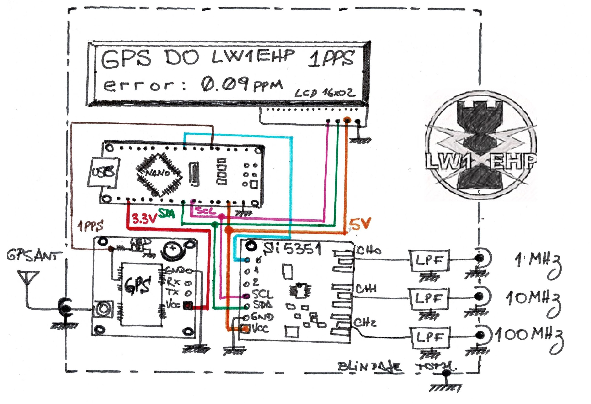

# GPSDO
**Construye un Oscilador Disciplinado por GPS**

Hernan LW1EHP

***En este articulo presentamos un proyecto relativamente fácil de construir, un oscilador basado en el módulo SI5351, pero con la ayuda de un modulo GPS, podemos convertirlo en un instrumento Patrón semiprofesional***

En muchas ocasiones, nos vemos inmersos “en las penumbras de la incertidumbre”, ¿mi equipo funciona en la frecuencia correcta? ...en primera instancia, busco un reporte de otro co-lega…pero ¿estará bien en frecuencia? ... bueno mejor utilizo una radiobaliza … pero y si no puedo sintonizarla … bueno listo voy corriendo al médico brujo de la Tribu RF (El Técnico) y le pido prestado el frecuencímetro ... pero a este instrumento ¿quién lo certifico? vemos una eti-queta que dice INTI 1973 y tiene más golpes que rodilla de zapatero ... Ahhhh ¿y ahora? Listo lo único que tengo certeza es que estoy en las “Penumbras de la incerteza”.
Para salir del horrible e inhóspito lugar de la incertidumbre presentamos un proyecto que nos permitirá referenciar cualquier equipo y/o frecuencímetro con las señales de GPS, las cuales tienen precisión del nano segundos, porque cada satélite de la constelación de GPS tiene un Reloj atómico de altísima precisión. 

# Hardware
Solo necesitamos cualquier microcontrolador, aunque aquí presentamos el Arduino Nano, un módulo DDS el re contra conocido Si5351 y un Módulo de GPS con salida 1PPS. A continua-ción presentamos el esquema básico del proyecto, obviamente como siempre puede ser modifi-cado y ajustado a las necesidades e imaginación de cada lector.
- **Arduino NANO**
- **Modulo SI5351**
- **Display LCD 16x02 con I2C**
- **Modulo GPS con señal 1pps**

# Concepto del Funcionamiento
Principalmente todo el circuito se puede resumir como un Generador DDS con 3 salidas habilitadas en forma simultánea, el Canal 0 en 1MHz , el Canal 1 en 10MHz y el Canal 3 en 100MHz, cualquiera de las 3 salidas puede utilizarse para calibrar o referenciar un equipo y/o instrumentos. El canal 0 también se utiliza como lazo de control y auto ajuste.
El Modulo GPS solo se requiere para obtener la señal 1PPS, la cual es una señal rectangular con una frecuencia exacta de 1 Hz, la misma solo esta presente cuando el modulo se “sincroniza” con la constelación de satélites que integran al Sistema GPS. Esta señal no esta sujeta a las osciladores propios del modulo ni ninguna referencia mas que la aportada por los propios satélites que se encuentra recibiendo. Recordamos que cada satélite contiene un reloj atómico para su funcionamiento, por lo tanto nuestro modulo GPS es un remoto de muchos relojes atómico con precisión de nanosegundos.
El micro controlador realiza la lectura de los pulsos provenientes del Canal 0, recordamos que al ser de 1 MHz, durante 1 segundo de captura podrá contar 1 millon pulsos, pero durante una ventana de tiempo de 40 segundos debería de contar 40 millones de pulsos. El tamaño temporal de la ventana se controla contando exactamente 40 pulsos de la señal 1PPS, y no dependemos de la base de tiempo propia del microcontrolador.
Ahora que sabemos que en 40 eventos de 1PPS deberíamos contar 40 millones de pulsos, podemos calcular el error de generación del Módulo DDS SI5351 como la diferencia entre los pulsos contado y los esperados. A través de instrucciones podemos corregir por software el corrimiento de la referencia de su oscilador.

# Software
El archivo .INO, se encuentra disponible en el siguiente repositorio de GitHub:
https://github.com/hernanporrini/GPSDO respecto a las librerías, solo se requiere de las librerías necesaria para SI5351 y del Display LCD16x2 con comunicación i2c.

# Modulo GPS
Se requiere de un módulo GPS, que tenga salida 1PPS, en el caso del NEO6 de uBlox, se puede acceder desde el Led de actividad el cual una vez que sincroniza funciona como 1pps.

# Filtro LPF
Se recomienda el uso filtros para no contaminar ni generar una mala lectura de los instrumentos al momento de calibrarlos, se propone el uso de filtros pasa bajos LC de 3er orden con frecuencia de corte en 1.5 , 15 y 150 MHz

# Error relativo y estabilidad
En teoría cuanto mayor es el tiempo de funcionamiento y/o mayor es el número de satélites visibles por el módulo GPS, mayor será la precisión obtenida en la generación del DDS. Experimentalmente se comprobó siempre partiendo desde el arranque frio del GPS, en los primeros 15 minutos de funcionamiento se obtiene una precisión cercana a 1ppm.  
En tiempos posteriores a las 8 hs se obtienen errores relativos dentro de la franja de
+/- 0.05 ppm. con una ocurrencia superior al 90%
Recordamos que 1ppm en una frecuencia de 1MHz equivale al 1Hertz de error.

